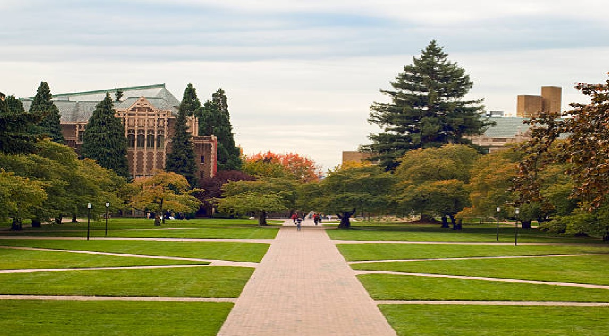

# Rodrick Ryan E. Danao

rynao@uw.edu

http://www.facebook.com/RyanDanao

http://www.linkedin.com/in/ryandanao

# Summary

My strongest subjects have always been English and Mathematics. Throughout my college years, I have also discovered a newly found passion of mine in Information Systems and Data Science. 

If given the opportunity, I would love to work as a tutor for STEM Tutoring and work with students who have been in my place before when I moved back to the U.S.

# Work Experience (only last 10 years)

## Seton Hall University (South Orange, New Jersey)

* [Seton Hall University][] 
> One of the country's leading Catholic universities, Seton Hall University has been developing students in mind, heart and spirit since 1856. Home to over 10,000 undergraduate and graduate students and offering more than 90 rigorous majors, Seton Hall's academic excellence has been singled out for distinction by The Princeton Review, U.S. News & World Report and Bloomberg Businessweek.. (Source: https://www.shu.edu/about.cfm)*

**Sports Poll Data Gatherer (Student Employee)** (Sep 2017 - Apr 2018)

Gathered data by conducting phone call interviews regarding current events and issues in sports to be documented for research purposes 

- Only **Freshman** Employee
- Employee of the Month (twice)

## University of Washington (Seattle, Washington)

*[University of Washington][] 
> The UW is one of the world’s preeminent public universities. Our impact on individuals, our region and the world is profound — whether we are launching young people into a boundless future or confronting the grand challenges of our time through undaunted research and scholarship. Ranked No. 7 in the world on the U.S. News & World Report’s Best Global Universities rankings, the UW educates more than 54,000 students annually. We turn ideas into impact and transform lives and our world. For more about our impact, visit our news site, UW News. (Source: https://www.washington.edu/about/?utm_source=whitebar&utm_medium=click&utm_campaign=about&utm_term=abouttheuw)*

**Chapter President at the University of Washington (RSO)** (Jul 2021 - Present)

The Society for Collegiate Leadership & Achievement (SCLA) is a multi-disciplinary honor society with 60,000+ members at 600+ colleges nationwide. We aim to maximize student potential through our powerful skill development platform including training content on hundreds of skills critical to a successful career, a vibrant mentor and peer community, hundreds of career insider interviews, and direct personal access to hiring managers and internship opportunities.

- First Chapter President for SCLA at **UW**.
- Organized Cuts for Change Event  

[Seton Hall University]: https://www.shu.edu/
[University of Washington]: https://www.washington.edu/